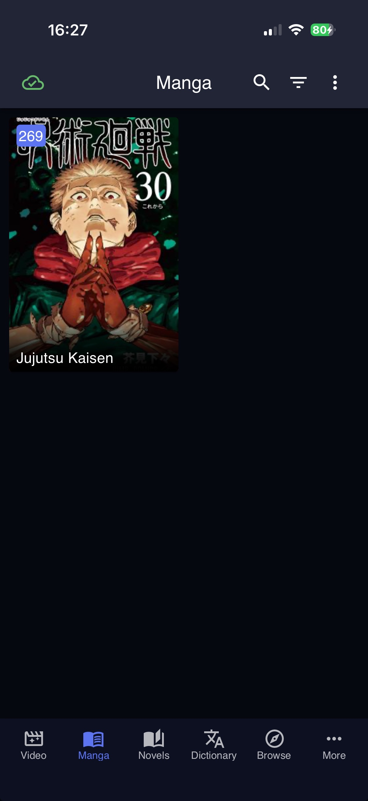
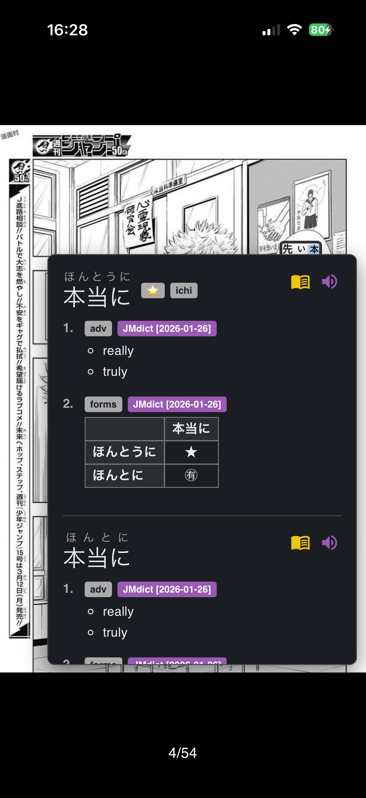
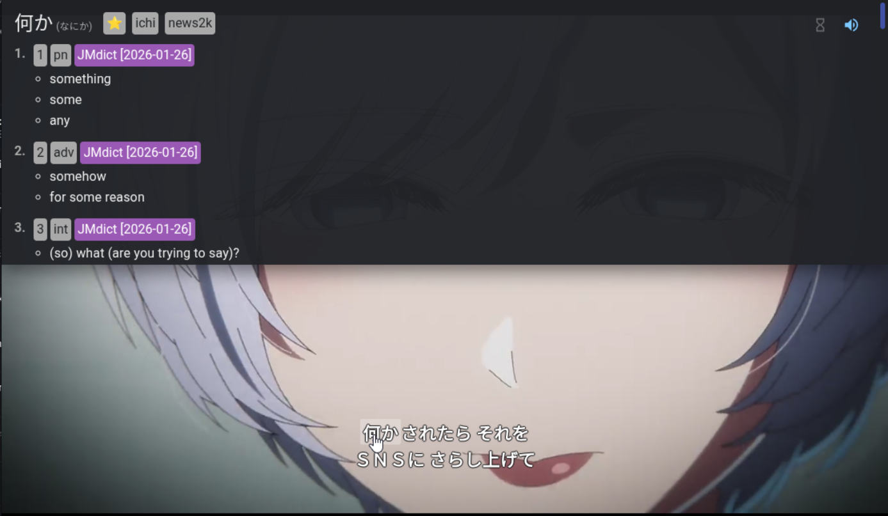

# Manatan

**The easiest way to watch anime or read manga, light novels, and EPUBs with instant OCR/subtitle lookup.** *No scripts, no complex setup—just download and go.*

Website: https://manatan.com  
Discord Server: https://discord.gg/tDAtpPN8KK

## Screenshots

  
  
  

## ✨ Why Manatan?

Traditional setups for watching anime or reading manga with Japanese lookup can be complicated, often requiring users to install Python scripts, browser extensions (like userscripts), and configure local servers manually.

**Manatan simplifies everything into a single app:**
* **Zero Configuration:** No need to install "Monkey scripts," configure Optical Character Recognition (OCR) tools, or mess with command lines.
* **Universal Language Support:** Manatan supports every language.
* **Built-in OCR for Manga:** Just hover over text to get selectable text for dictionary lookups.
* **Anime Support:** Subtitle parsing with popup dictionary lookups while you watch.
* **1-Click Anime Cards:** Generate Anki cards from anime sentences with a single click, with sentence audio.
* **Novel Support:** Read EPUBs with sync across devices, instant dictionary lookups, and Anki card generation.
* **Sync:** Keep your media progress and learning data synced across devices.
* **Manga File Support:** Read local manga from folders, CBZ/ZIP, EPUB, and modern image formats like JPEG XL.
* **Cross-Platform:** Run the exact same interface on your PC, Mac, Android, or iOS device.
* **Extensible:** Supports Mihon, Aniyomi, and Aidoku extensions

### 🖥️ Supported Platforms
| Windows | Linux | macOS | Android | iOS |
| :---: | :---: | :---: | :---: | :---: |
| ✅ | ✅ | ✅ | ✅ | ✅ |

> **📱 iOS Users:** The iOS app is currently in **Public Beta**. Please join our [Discord Server](https://discord.gg/tDAtpPN8KK) to find the TestFlight invite link.

## 🚀 Getting Started

Download the latest release for your platform from the [Releases](https://github.com/KolbyML/Manatan/releases) page.

Run the executable, then visit `http://127.0.0.1:4567/` in your web browser to access the Manatan web interface.

For Nix and NixOS, a [Flake](https://github.com/GKHWB/Manatan-Flake) is available.

## Roadmap

- [x] Package Manatan, OCR server, and source runtime into a single app.
- [x] Add Windows, Linux, macOS, Android, and iOS support.
- [x] Add anime/video playback and subtitle lookup.
- [x] Add manga reading and OCR lookup.
- [x] Add one-click anime/video cards.
- [x] Add novel and EPUB reading.
- [x] Add novel sync support across devices.
- [x] Add word audio.
- [x] Add Mihon/Tachiyomi, Aniyomi, and Aidoku extension support.
- [x] Add local `.mkv` video support.
- [x] Add local manga archive and EPUB support.
- [x] Add native Android runtime without bundled JVM assets.
- [x] Add Sync support for Video, Manga, Novels, and more.
- [x] Add EPUB support for Manga
- [ ] Fully Rewrite the Novel Reader
- [ ] Add MPV-based video player for Android
- [ ] Continue improving local media setup and scanning UX.
- [ ] Add Mangayomi and LNReader extension support.
- [ ] Add one-click local audio setup for popup dictionary lookups.
- [ ] Add local OCR engine support.
- [ ] Add manga immersion stats.
- [ ] Suggest more features on [GitHub Issues](https://github.com/KolbyML/Manatan/issues/new).

## Setup

1.  Download the latest release for your platform from the [releases](https://github.com/KolbyML/Manatan/releases) page.
    * **Windows:** Download the `.zip` file for `windows-x86`, extract it, then launch `manatan.exe`.
      * *Note: If prompted by Windows Defender SmartScreen, click **More info** > **Run anyway**. If it doesn't run on double-click, right-click the file > **Properties** > **Unblock**.*
    * **macOS:** Download the macOS build, unzip it, then open `Manatan.app`.
      * *If macOS blocks the app because it is unsigned, go to **System Settings** > **Privacy & Security** and click **Open Anyway** for Manatan, then reopen the app.*
2.  A "Manatan Launcher" window will appear. Click "**Open Web UI**".
3.  **Windows:** Allow Windows Firewall connections if prompted.
4.  The Manatan web interface (`127.0.0.1:4567/`) should open in a new browser tab.
    * *Please wait ~30 seconds for the initial setup to finish. Reload the page to access the library.*
5.  **Adding Sources:**
    * Google how to use Mihon, then if you want to try other extension support google how to use Aniyomi or Aidoku.
6.  **Installing Extensions:**
    * Go to **"Browse"** on the left sidebar, then the **"Extensions"** tab.
    * Click **"Install"** on your desired source.
7.  **Start Watching or Reading:**
    * Go to the **"Sources"** tab, click your installed source, and find an anime or manga.
    * **OCR and subtitle lookup are automatically active!** You can use tools like Yomitan immediately.
* For Yomitan Users:
   * To ensure sentences are parsed correctly for Anki cards, go to Text parsing in Yomitan's settings (enable Advanced), and set Sentence Termination to "Custom, No New Lines". This prevents OCR line breaks from being treated as sentence endings.
   * Disabling ellipsis `…` as a sentence terminator is also recommended.

## Local Manga
You can also read manga files stored locally on your device. To set up local manga:  
1. Set your local manga directory in Settings → Browse → "Local source location"
2. Use one of these paths depending on your platform:
* Android Internal Storage: Use paths like `/storage/emulated/0/YourFolder/`
* Android SD Cards: Use `/storage/[SD_CARD_ID]/YourFolder/` where [SD_CARD_ID] is the unique identifier Android assigned to your SD card (you can find this using file manager apps like X-plore)
* Windows: The default local manga directory is at C:\Users\[YourUsername]\AppData\Local\Tachidesk\local)
3. You will then be able to find your local manga under **Browse → Sources → Local source**
### Important : Your manga must follow a specific folder structure to be detected properly.
Refer to the [Manatan local manga guide](https://manatan.com/docs/guides/local-manga) for details on how to structure your folders.

## Local Anime
You can also watch anime files stored locally on your device. To set up local anime:
1. Set your local anime directory in Settings -> Browse -> "Local anime source location"
2. Place your files in the expected folder structure for detection

Refer to the [Manatan local anime guide](https://manatan.com/docs/guides/local-anime) for details on folder layout and naming.

## Troubleshooting

To fully clear cache and data from previous installs, delete the following folders and try again:

* `manatan-windows-x86` (Your extraction folder)
* `%LOCALAPPDATA%\Tachidesk`
* `%APPDATA%\manatan`
* `%Temp%\Suwayomi*`
* `%Temp%\Tachidesk*`
* **Browser Data:** Clear Site data & cookies for `127.0.0.1`

## 📚 References and acknowledgements
The following links, repos, companies and projects have been important in the development of this repo, we have learned a lot from them and want to thank and acknowledge them.
- https://github.com/kaihouguide/Mangatan
- https://github.com/exn251/Mangatan/
- https://github.com/Suwayomi/Suwayomi-Server
- https://github.com/Suwayomi/Suwayomi-WebUI
- https://github.com/Manhhao/hoshidicts/tree/main-mit

## Star History

